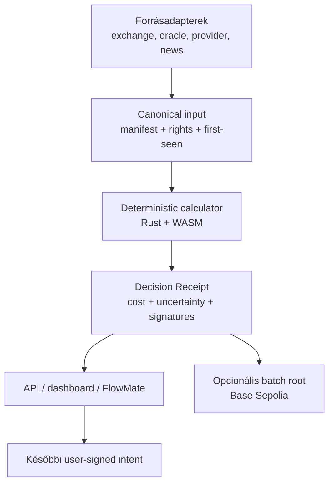

> **Repository status:** dated strategy/research input, not an accepted ADR.
> Product names, budgets, rankings, legal interpretations, chain sequencing, token
> policy, and roadmap changes remain hypotheses until the repository's ADR, modeling,
> simulation, cross-review, and human merge gates accept them.
> Console agents start at `docs/ai/CONSOLE_HANDOFF_AUDIT_AND_PRODUCT_STRATEGY_2026_07_16.md`.
# HDCN × FlowMate — innovációs, termék- és protokollstratégia

**Kutatás dátuma:** 2026. július 16.

**HDCN vizsgált főági commit:** `fb945f62a6cf7fe55915e88e5b87a43ff271811c`
**FlowMate vizsgált főági commit:** `6d703cdc66e4aff55c9a8b096f5e090515ad7bce`

## Vezetői döntés

A legerősebb fejlesztési irány nem egy újabb általános compute-piactér, currency converter, DeFi-vault vagy token. Ezek külön-külön zsúfolt piacok, és együtt túl nagy technikai, likviditási, biztonsági és engedélyezési kockázatot hoznának.

> **Építsetek egy könnyű, off-chain-first „Verifiable Decision Network” magot: adatból és számításból reprodukálható, aláírt, bizonytalanságot és teljes költséget tartalmazó Decision Receipt készüljön. Az első fizetős termék a funding/carry-kalkulátor, a második a workload-specifikus CPU/GPU-költségkalkulátor legyen.**

A közös mag munkaneve lehet **ProofQuote**. A név csak munkanév; márka-, domain- és védjegyvizsgálat szükséges.

Az ajánlott sorrend:

1. **CarryLens:** ellenőrizhető funding/carry és break-even intelligence;
2. **ComputeQuote:** CPU/GPU munkafolyamat idő-, költség- és megbízhatósági ajánlata;
3. **EvidenceGraph:** licenc- és provenance-tudatos piaci hír-/eseményhálózat;
4. **Rebalance Guard:** szimuláció és ember által aláírandó rebalancing intent;
5. **BuildProof:** GitHub- és mérföldkő-alapú projektfinanszírozási kalkulátor.

Az MVP-ben ne legyen saját token, custody, automata kereskedés, saját bridge, saját L1, permissionless node-belépés vagy hozamígéret. USD/euró legyen a számviteli egység, USDC később a fizetési eszköz. A Base csak ritka batch-anchor és későbbi settlement legyen, ne a számítás hot pathja.

## 1. Közvetlen válaszok a felvetésekre

| Felvetés | Ajánlás | Döntés |
|---|---|---|
| Milyen irányban fejlesszük? | Ellenőrizhető, teljes költségű döntési ajánlatok; elsőként funding/carry | **GO** |
| Hogyan lesz új és innovatív? | Ár helyett landed cost + provenance + bizonytalanság + reprodukálható outcome | **GO** |
| Lightweight, gyors, hatékony, profitábilis protokoll? | Off-chain WASM, request-scoped verification, cache, batch-anchor, előfizetés/API | **GO** |
| Currency converter? | Ne egyszerű FX-widget; „mennyi lesz ténylegesen elkölthető a céloldalon?” kalkulátor | **Feltételes GO** |
| Funding calculator? | Történeti funding-eloszlás, basis, díj, margin, transfer és stressz együtt | **Első termék** |
| Founding/projektfinanszírozási kalkulátor? | Runway, milestone és grant-fit GitHub-bizonyítékokból | **Másodlagos pilot** |
| Rebalancing network? | Ne építsetek új solver/bridge hálózatot; meglévő infrastruktúra feletti risk scoring | **Adapter-only** |
| Investing protocol? | Először research/read-only; később ember által jóváhagyott Safe proposal | **Később** |
| Market info és news network? | Rights-aware EvidenceGraph, nem általános „AI sentiment oracle” | **GO** |
| CPU/GPU token changer? | Workload-specifikus compute-unit és költségkonverter, nem likvid token | **GO quote-only** |
| Saját compute token? | Technikai lehetőség, de nincs most rá termék- vagy likviditási indok | **NO-GO most** |

A „funding/founding” kifejezést kétféleképpen értelmeztem: perpetual funding rate kalkulátorként és projekt-/startup-finanszírozási kalkulátorként. Mindkettő használható, de az első sokkal jobban illeszkedik a FlowMate meglévő kódjához és gyorsabban monetizálható.

## 2. Mi legyen az egyedi innováció?

Az innováció ne az legyen, hogy „blockchain + AI + GPU + token”. Ezt sok projekt állítja. A védhető különbség egy egységes, auditálható **Decision Receipt**:

- pontosan mely források és mely időpontban látott állapotok szolgáltak inputként;
- mi az input, kód, modell, parser és runtime hash-e;
- melyik kalkulátorverzió és execution profile futott;
- mi a bruttó eredmény és minden levont költségkomponens;
- mennyi az adat frissessége, bizonytalansága és a P10/P50/P90 tartomány;
- ki futtatta és ki ellenőrizte újra;
- milyen későbbi outcome alapján mérhető, hogy az ajánlat jó volt-e;
- mely korábbi receiptből származik.

Ez ugyanazzal a sémával több vertikumot szolgál ki:

- funding opportunity → nettó carry receipt;
- GPU job → teljes compute quote receipt;
- hír/esemény → evidence receipt;
- portfóliódelták → rebalance proposal receipt;
- open-source mérföldkő → funding eligibility receipt.

Az érték nem pusztán az aláírás. Fontos különbségek:

1. **aláírás nem azonos az identitással**;
2. **identitás/provenance nem azonos az igazsággal**;
3. **források száma nem azonos a független megerősítéssel**;
4. **sentiment nem azonos kereskedhető alpha-val**;
5. **oracle nem ad automatikusan adatlicencet**;
6. **token stake nem bizonyít szakértelmet vagy Sybil-ellenállást**.

A provenance mintájához a [W3C PROV-O](https://www.w3.org/TR/prov-o/), az artifact-állításokhoz az [in-toto Attestation Framework](https://github.com/in-toto/attestation), a signed statement/transparency receipt architektúrához pedig a 2026 júniusában kiadott [IETF SCITT RFC 9943](https://datatracker.ietf.org/doc/rfc9943/) hasznos referencia. Ezekből mintát lehet venni; konformitást csak valódi profil és tesztelés után szabad állítani.

## 3. Ötletek rangsora

A pontszám szakmai döntéstámogató becslés. Súlyok: meglévő kód újrahasznosítása 25%, bevételig eltelt idő 20%, differenciálhatóság 20%, építési egyszerűség 15%, jogi/biztonsági kockázat 10%, tőkeigény 10%.

| Hely | Termék | Pont | MVP | Miért? |
|---:|---|---:|---:|---|
| 1 | CarryLens / Verified Funding & Carry | **9,2/10** | 6–10 hét | FlowMate-ben már van funding, break-even és backtest alap; gyors B2B API/SaaS |
| 2 | EvidenceGraph / Market Evidence API | **9,0/10** | 8–12 hét | Erős hosszú távú moat: rights + first-seen + outcome + lineage |
| 3 | ComputeQuote / CPU–GPU Cost Oracle | **8,8/10** | 8–14 hét | A HDCN küldetéséhez illik, token nélkül is hasznos és eladható |
| 4 | Rebalance Guard / Policy Compiler | **7,4/10** | 10–18 hét | Jó bővítés, de az execution és a személyre szabott advice növeli a kockázatot |
| 5 | BuildProof / Founding Calculator | **7,0/10** | 8–14 hét | Innovatív GitHub-evidence vertikum, de más vevő és sales-folyamat |
| 6 | Total Landed Cost Currency Router | **6,6/10** | 6–12 hét | Egyszerű FX konverterként commodity; kockázat/idő/költség együtt értékes |
| 7 | Token nélküli forecast-attestation liga | **6,5/10** | 8–12 hét | Jó validációs/reputációs kísérlet, de önmagában gyengébb üzlet |
| 8 | Bittensor/Vanta adapter vagy miner | **5,4/10** | 8–16 hét | Kiegészítő kereslet/jelforrás lehet, de nem saját core és nem stabil moat |
| 9 | Autonóm vault/portfolio manager | **4,0/10** | 9–18 hónap | Audit, custody, likviditás, engedélyezés és liability összeadódik |
| 10 | Saját compute token / token changer | **3,0/10** | 12–24+ hónap | Likviditás és értékígéret szükséges; a számítási ajánlat token nélkül jobb |

Kereskedelmi wedge-ként a CarryLens az első; hosszú távú adat- és workflow-moatként az EvidenceGraph a legerősebb. A ComputeQuote adja meg a HDCN saját, compute-központú identitását.

## 4. Első termék: CarryLens

### 4.1 Mit adjon?

Ne a következő funding rate-et évesítse naivan. Egy opportunity ajánlat legalább ezt számolja:

\[
\text{NetCarry} =
\text{ExpectedFunding}
- \text{Fees}
- \text{Slippage}
- \text{BasisRisk}
- \text{Borrow/CapitalCost}
- \text{Transfer/BridgeCost}
- \text{LiquidationBuffer}
- \text{VerificationCost}
\]

Kimenet:

- nettó P10/P50/P90 carry 1, 7, 30 és 90 napra;
- break-even napok;
- funding persistence és mean-reversion;
- negatív funding-regime valószínűsége;
- venue- és instrumentumspecifikus funding interval;
- VIP fee tier, maker/taker és várható fill;
- basis zárási kockázat;
- margin-, maintenance-tier- és liquidation buffer;
- borrow, transfer, withdrawal, bridge és capital-lock költség/idő;
- kapacitás: mekkora notionalig hihető a quote;
- frissesség, confidence és input receipt.

A Binance hivatalos API történeti funding rate-et és hozzá tartozó mark price-t szolgáltat, a funding info pedig instrumentumspecifikus `fundingIntervalHours` mezőt is hordoz; ezért a fix „napi három alkalom” feltevést nem szabad protokollszinten hardkódolni. [Binance USDⓈ-M market data](https://developers.binance.com/en/docs/catalog/core-trading-derivatives-trading-usd-s-m-futures/api/rest-api/market-data)

### 4.2 Mi van már meg a FlowMate-ben?

Hasznos alapok:

- `plugins/crypto/exchanges.py`: funding snapshot/history adapterek;
- `tools/carry_history_backtest.py`: valós funding history, DSR és correlated-tail stress;
- `core/carry_breakeven.py`: bps-alapú költségmodell;
- `core/backtest_realistic/carry_simulator.py`: realisztikusabb carry-szimuláció;
- `crypto_bot/arbitrage/funding_arb.py`: scanner és execution skeleton.

Ezért nem új repositoryt kell indítani, hanem a meglévő research elemekből egy read-only, egységbiztos quote service-t kell kialakítani.

### 4.3 Kritikus statikus kódmegállapítás

A jelenlegi [`funding_arb.py`](https://github.com/Matesensei/FlowMate_Trading_Assistant/blob/main/crypto_bot/arbitrage/funding_arb.py) eltérő egységeket kever:

- `spot_perp_spread_pct` valójában decimális basis, például `0.01 = 1%`;
- `round_trip_fee_pct` valódi százalékot ad, például `1.0 = 1%`;
- a `break_even_days` és `net_apr_pct_30d` közvetlenül összeadja ezeket.

Így a basis költsége százszoros eltéréssel kerülhet a számításba. Emellett a scanner fix napi három funding intervallumot feltételez, egymás után várja a hálózati hívásokat, és egyetlen pillanatnyi funding rate-et évesít. Ezt a termékesítés előtt tesztekkel kell javítani. A repo kódját ebben a kutatási körben nem módosítottam.

### 4.4 Miért lehet profitábilis?

Nem kell node-piactérrel, bridge-likviditással vagy token-market makinggel kezdeni. A költség főleg adatgyűjtés, számítás és ügyféltámogatás. Lehetséges csomagok:

- Free: késleltetett dashboard, limitált venue;
- Pro: €79–149/hó;
- Desk: €499–1 499/hó;
- API: €249/hó + usage;
- Enterprise/private deployment: €2 500–10 000+/hó;
- külön fizetett proof-of-value: €5 000–20 000.

Illusztratív, nem előrejelzés: 50 × €99 Pro + 12 × €499 Desk + 3 × €2 500 Enterprise + €3 000 API-usage = **€21 438 MRR**. Ha ebből 20% közvetlen adat/infra/support és €12 000 havi lean fix költség levonható, a modell pozitív működési hozzájárulást adhat. Ezt customer discoveryvel és tényleges churn/CAC/support adatokkal kell igazolni.

## 5. ComputeQuote: CPU/GPU token changer helyett

### 5.1 A helyes termék

A felhasználó ne „GPU tokent” váltson, hanem adjon meg egy workloadot, és kapjon összehasonlítható ajánlatot:

\[
\text{Quote} =
\text{ProviderBid}
+ \text{Startup/CacheMiss}
+ \text{Storage/Egress}
+ \text{Verification}
+ \text{Settlement}
+ \text{RiskReserve}
+ \text{Margin}
\]

Kimenet:

- várható completion time P50/P95;
- teljes USD/USDC költség;
- kapacitás és queue delay;
- energiahatékonyság és thermal throttling jelzés;
- provider reliability és retry-költség;
- verification tier és surcharge;
- kompatibilitás: VRAM, precision, driver/runtime, memória és storage;
- quote expiry és források.

Tokenben megjelenített egyenérték lehet UI-funkció: `USD quote / verified token price`, expiryvel és confidence-szel. Ez ne legyen visszaválthatósági vagy árfolyam-ígéret, és ne képezzen saját compute-pegged pénzt.

### 5.2 Nincs univerzális „egy GPU-óra”

A benchmark vektor workload-specifikus legyen:

- CPU/WASM: determinisztikus fuel, referencia-runtime, memory-bandwidth class, memória-limit;
- LLM inference: prompt/decode token/s, TTFT, batch size, model és precision;
- diffusion: kép/perc adott modell, felbontás és steps mellett;
- rendering: scene-specifikus benchmark és VRAM;
- training: samples/s vagy time-to-quality;
- általános GPU: VRAM, bandwidth, precision, interconnect, driver és reliability.

Az [MLPerf Inference](https://mlcommons.org/benchmarks/inference-datacenter/) külön workloadokat és deployment scenariókat mér; a [Render OctaneBench 2025](https://know.rendernetwork.com/getting-started/render-network-tutorials/using-octanebench-2025-to-benchmark-your-gpu-and-estimate-render-costs) valós render scene-ekkel becsül, a Render árazása pedig speed/security/cost tier-eket használ. Ez jó bizonyíték arra, hogy egyetlen hardverpontszám nem elég minden feladathoz. [Render pricing](https://know.rendernetwork.com/basics/how-much-does-rndr-cost)

A meglévő decentralizált compute hálózatok árazási primitívjeit adapterként érdemes fogyasztani, nem újraépíteni. A Golem például start-, CPU- és environment-hour komponenseket különít el, az Akash pedig provider pricing benchmarkot és audit/verification folyamatot használ. [Golem pricing model](https://docs.golem.network/docs/creators/ray/cluster-yaml), [Akash Provider Console](https://akash.network/blog/introducing-akash-provider-console/), [Akash provider operations](https://akash.network/docs/providers/operations/)

### 5.3 Monetizáció

- API/dashboard előfizetés;
- private provider catalog;
- provider lead/referral díj;
- verified quote surcharge;
- később explicit worker + verifier költség feletti 20–35% cél contribution margin.

A korábbi egyszerű 8–12%-os flat take nem biztonságos alap, mert egy 2-of-3 újrafuttatás önmagában felemésztheti a marzsot. Az alap, Verified és High Assurance tier külön árazandó.

### 5.4 Három külön proof

A compute protocolban nem szabad összemosni:

- **capacity proof:** a provider rendelkezik és elérhetővé tesz egy hardverosztályt;
- **metering proof:** a job ennyi CPU/GPU/memória/I/O egységet fogyasztott;
- **correctness proof:** a job helyes outputot adott.

Egy `nvidia-smi` riport vagy aláírt usage counter nem correctness proof. Tetszőleges CPU/GPU programra nincs olcsó, univerzális bizonyítás. Az [Ofelimos](https://eprint.iacr.org/2021/1379) például speciális, nyilvánosan ellenőrizhető optimalizációs feladatosztályra ad proof-of-useful-work konstrukciót; ebből nem következik általános GPU correctness. Az MVP helyes állítása ezért **Verified Useful Compute Receipt**, nem új PoUW consensus.

Javasolt erősségi osztályok:

| Osztály | Mit bizonyít? | Automatikus payout? |
|---|---|---|
| V0 | worker self-report | nem |
| V1 | capacity attestation + signed meter | csak alacsony cap mellett |
| V2 | véletlen sampled replay | policy/cap szerint |
| V3 | deterministic full replay vagy optimistic dispute | igen, finalizálás után |
| V4 | workload-specifikus succinct/ZK proof | igen, ha auditált |

### 5.5 Quote lifecycle

Külön állapot legyen a becslés, a kötelező ajánlat és a tényleges fogyasztás:

`Estimate → SignedBindingQuote → Funded → MeteredUsageReceipt → VerificationAttestation → SettlementReceipt`.

A provider `RateCard` rövid TTL-t, monotonic sequence-t, workload profile-okat, kapacitást, régiót, árat és domain-separated aláírást tartalmazzon. A P2P rétegben csak hash/summary hirdetés fusson; a requester 3–10 alkalmas providernek küldjön titkosított direkt RFQ-t. Ne kerüljön minden ajánlat globális gossipba vagy on-chain aukcióba.

Egy aláírt quote kötelező mezői: `quote_id`, nonce, manifest hash, benchmark profile/version, rate vector, startup/minimum bill, maximum cost, expiry, SLA, verification class, chain+asset identity, oracle reference és provider signature.

Illusztratív compute unit economics: egy €2 500-as RTX 4090 node 30 hónapos élettartammal, 40% fizető kihasználtsággal, 450 W terheléssel és €0,25/kWh árral — ops, audit és margin után — körülbelül €0,60–0,80/GPU-óra minimum ársávba kerülhet. Ez nem piaci quote; a helyi energia, CapEx, kihasználtság, hűtés, support és verification erősen módosítja. A protokoll ne hardkódoljon hardverárat.

## 6. EvidenceGraph: piaci információ és hírek

### 6.1 Ne „truth oracle” legyen

A hálózat azt bizonyítsa, hogy mely forrásból, mikor, milyen bytesorozat és parser alapján készült egy állítás. Ne állítsa automatikusan, hogy a hír igaz.

Javasolt pipeline:

1. first-party vagy licencelt RSS/Atom/API, issuer, regulator, protocol release, governance és on-chain log;
2. 3 adminisztratívan független fetcher aláírja a `(URI, HTTP metadata, raw_hash, fetched_at, parser_version)` rekordot;
3. source-family clustering: 20 wire-story átvétel ne számítson 20 megerősítésnek;
4. claim/entity/event extraction és külön challenger worker;
5. asset és 5m/1h/24h horizon szerinti valószínűségi hatás;
6. market-beta-korrigált outcome és FlowMate event-study;
7. receipt, challenge state, majd napi batch-root.

Minimális `MarketEventV1` mezők:

`source_uri`, `publisher_id/key`, `published_at`, `first_seen_at`, `raw_hash`, `canonical_hash`, `rights_id/rights_uri`, `claim`, `entity`, `asset`, `parser/model/container_hash`, `worker_signatures`, `impact_probability`, `horizon`, `challenge_state`, `batch_root_ref`.

A `published_at` és `first_seen_at` különválasztása kötelező; különben a történeti backtestbe később megismert adat szivároghat.

A GDELT nyílt, közel valós idejű globális híresemény-gráf, az SEC EDGAR API pedig first-party vállalati filing adatforrás lehet. [GDELT](https://www.gdeltproject.org/), [SEC EDGAR API](https://www.sec.gov/search-filings/edgar-application-programming-interfaces)

A [C2PA 2.4](https://spec.c2pa.org/specifications/specifications/2.4/index.html) cryptographically verifiable media provenance-t adhat, de nem bizonyítja egy állítás valóságtartalmát. Csak tényleges C2PA manifestet hordozó tartalomnál használható. A Rust implementációt kiadott verzióra és explicit trusted-issuer allowlistre kell pinelni; a projekt 2026. július 15-én épp trust-root viselkedést javított. [c2pa-rs javítás](https://github.com/contentauth/c2pa-rs/commit/4497b8b6f48e69bae0147829d98f431ed977942d)

### 6.2 FlowMate integráció

A jelenlegi `crypto_bot/news.py` egyszerű RSS keyword watcher. Cím+összefoglaló kulcsszót keres, majd link/cím hash-t készít. Nincs licencledger, source-family dedup, first-seen történet, entity resolution, challenge, confidence, outcome-label vagy leakage-safe event-study.

Az EvidenceGraph outputját a FlowMate immutable EventTape-jébe kell illeszteni, majd purged/embargoed OOS backtesten, költséggel és ablationnel vizsgálni. A cél nem „AI megmondja merre megy az ár”, hanem annak mérése, hogy egy evidence feature ad-e stabil, inkrementális prediktív értéket.

### 6.3 Az adatjog a termék része

Minden forráshoz rights record kell: ingest, tárolás, retention, model-use, output, újraközlés, földrajz és ügyféltípus. Az RSS elérhetőség nem jelent kereskedelmi újraközlési jogot. Egy aktuális CoinDesk API-licenc például az internal-use adat pénzügyi termékhez vagy commercial service-hez kötött használatát is korlátozhatja. [CoinDesk API licence](https://data.coindesk.com/api-licence-agreement)

Ezért az első 10–20 forrás regulator/issuer/protocol first-party vagy kifejezetten licencelt legyen; általános web- és social scraping ne legyen az MVP része.

## 7. Currency converterből Total Landed Cost Router

Egy egyszerű USD/EUR/BTC átváltó nem védhető termék. A hasznos kérdés:

> „Ha most elindítok X összeget A helyről B chainre/venue-re, mennyi lesz ténylegesen elkölthető, mikor ér oda, és milyen kockázattal?”

\[
\text{SpendableOutput} =
\text{Input} \times \text{ReferenceRate}
- \text{Spread}
- \text{TradingFee}
- \text{Slippage}
- \text{Gas}
- \text{Withdrawal/BridgeFee}
- \text{RiskBuffer}
\]

A receipt tartalmazza:

- reference price és executable quote külön;
- minden díj és spread;
- minimum output;
- arrival time P50/P95;
- finality/reorg/failure feltétel;
- liquidity/capacity;
- quote expiry és staleness;
- custody/approval igény;
- route risk score.

Az oracle-t nem kell újraépíteni. A Chainlink Data Streams low-latency off-chain adatot ad on-chain verifikálhatósággal, a Pyth pedig market-participant price feed infrastruktúra. [Chainlink Data Streams](https://docs.chain.link/data-streams), [Chainlink signed reports](https://docs.chain.link/data-streams/reference/overview), [Pyth how it works](https://docs.pyth.network/price-feeds/core/how-pyth-works)

Fontos: az oracle price nem azonos executable venue quote-tal, és az oracle használata nem ad jogot más upstream híradat újraértékesítésére.

Fiat referenciaárhoz az ECB SDMX API és módszertan használható, de a napi referenciaár nem executable quote. [ECB API](https://data.ecb.europa.eu/help/api/overview), [ECB exchange-rate methodology](https://data.ecb.europa.eu/methodology/exchange-rates). A Pyth dokumentáció 2026. július 31-re Core-upgrade-et jelez; integráció előtt az aktuális címeket, API-key követelményt és adapterverziót újra kell validálni. [Pyth upgrade preparation](https://docs.pyth.network/price-feeds/core/upgrade/preparing)

## 8. Rebalancing: hálózat helyett policy compiler

### 8.1 Mit építsünk?

Read-only szimulátort, amely célallokációból deltákat készít és csak akkor javasol tranzakciót, ha:

\[
\text{ExpectedBenefit} >
\text{LandedCost}
+ \text{Tax/LockupBuffer}
+ \text{LiquidityRisk}
+ \text{SafetyHysteresis}
\]

Kimenet kezdetben JSON/PDF proposal. Később unsigned vagy user-signed intent, amelyet a felhasználó Safe/CoW/UniswapX felületen hagy jóvá. A mag ne tartson seedet, exchange key-t vagy ügyfélvagyont.

### 8.2 Mit ne építsünk újra?

Az Open Intents Frameworknek már van aktív Rust [quote aggregatora](https://github.com/openintentsframework/oif-aggregator) és [solvere](https://github.com/openintentsframework/oif-solver); a solver automatikus cross-chain token rebalancinget is tartalmaz. A CoW programmatic orderekkel és TWAP-pal támogat conditional/rebalancing logikát, az UniswapX-en permissionless fillerek versenyeznek az executionért. [CoW programmatic orders](https://docs.cow.fi/cow-protocol/concepts/order-types/programmatic-orders), [CoW TWAP](https://docs.cow.fi/cow-protocol/concepts/order-types/twap-orders), [UniswapX](https://developers.uniswap.org/docs/liquidity/uniswapx/overview)

A HDCN differenciálása ezek felett legyen:

- determinisztikus, receipt-alapú risk-adjusted quote scoring;
- route és solver historikus fill/failure/latency outcome;
- teljes landed cost és confidence;
- audit trail és policy compliance;
- a saját worker payout treasury belső nettingje.

Az első tényleges rebalancer ne ügyfélportfóliót, hanem a HDCN saját, későbbi USDC payout treasuryjét kezelje. Előre jelezze lánconként a customer depositot és worker payoutot, tartson cél-egyenlegsávot, először nettósítson, és csak a maradékot mozgassa. Az optimalizáció a route fee, settlement time, failure CVaR, tőkelekötés és minimum likviditás együttese legyen. Nagy összegnél multisig/manual gate, cooldown, transfer cap és maximum párhuzamos mozgás szükséges. Ez valódi belső megtakarítást adhat anélkül, hogy a projekt diszkrecionális ügyfél-portfóliókezelővé válna.

### 8.3 ERC-7683 figyelmeztetés

Az [ERC-7683](https://eips.ethereum.org/EIPS/eip-7683) 2026. július 16-án továbbra is **Draft**. A jelenlegi szöveg solver-facing resolver és általános step/variable/payment reprezentáció; a régi draft `GaslessCrossChainOrder` és `IOriginSettler` modelljét külön „Previous Draft” részben kezeli. A HDCN dokumentumaiban szereplő régi sémát nem szabad hardkódolni. Verziózott adapter és conformance fixture kell. Az Across ettől függetlenül saját settlerrel production integrációt dokumentál. [Across ERC-7683](https://docs.across.to/guides/concepts/erc-7683)

## 9. Investing protocol: mit igen, mit nem?

### Most

- portfolio analytics;
- risk, drawdown, exposure és landed-cost szimuláció;
- általános, nem személyre szabott kutatási rangsor;
- FlowMate-ben DSR/PBO, purged/embargoed OOS és execution-realism;
- ember által jóváhagyandó tranzakció-javaslat.

### Később

Safe proposal queue: a rendszer javasol, a tulajdonosok írnak alá. A Safe támogat off-chain proposal és confirmation gyűjtést. [Safe proposal flow](https://docs.safe.global/sdk/api-kit/guides/propose-and-confirm-transactions)

### Nem most

- saját ERC-4626 vault;
- diszkrecionális ügyfélportfólió-kezelés;
- auto-signing agent;
- unlimited approval;
- yield guarantee;
- saját prediction market vagy tétre menő forecast liga.

Az [ERC-4626](https://eips.ethereum.org/EIPS/eip-4626) már standardizálja a tokenized vault API-t, a Safe module-ok pedig komplex automatizálást adnak. Ez azt jelenti, hogy a szabványos execution elemek rendelkezésre állnak; nem azt, hogy audit, jogi minősítés és kockázatkezelés nélkül biztonságosak. A Safe modulok alternatív execution jogot kaphatnak, ezért proposal-only módból kell indulni. [Safe modules](https://docs.safe.global/advanced/smart-account-modules)

EU-s célpiacon a MiCA a crypto-advice és a diszkrecionális portfolio management szolgáltatásokat szabályozott kategóriaként kezeli, suitability és engedélyezési kötelezettségekkel. A funkció számít, nem a „not financial advice” felirat. [ESMA MiCA](https://www.esma.europa.eu/esmas-activities/digital-finance-and-innovation/markets-crypto-assets-regulation-mica), [MiCA hivatalos szöveg](https://eur-lex.europa.eu/legal-content/EN/TXT/HTML/?uri=CELEX%3A32023R1114)

## 10. Founding / projektfinanszírozási kalkulátor

A másik értelmezésből külön B2B/B2G termék lehet: **BuildProof**.

Input:

- GitHub commit/PR/release/test és artifact evidence;
- contributor bus factor és release cadence;
- dependency/use/adoption jelek;
- audit, security és reproducibility;
- milestone budget, burn és runway;
- grant program jogosultsági feltételek.

Output:

- runway és milestone-finanszírozási igény;
- „grant fit” és hiányzó bizonyíték;
- impact score magyarázattal;
- mérföldkő receipt;
- human review queue.

Ne automatikus pénzosztó algoritmusként induljon. Az Open Source Observer hatás- és open-source adatpipeline-ja, valamint az Optimism retroaktív finanszírozási modellje bizonyítja, hogy az artifact/impact evidence valós programok inputja lehet. [Open Source Observer](https://github.com/opensource-observer/oso), [Optimism Retro Funding](https://optimism.io/blog/retro-funding-2025)

Ez jó későbbi vertikum, de eltér a trading/compute vevőtől, ezért ne lassítsa az első CarryLens MVP-t.

## 11. Könnyű protokollarchitektúra



### 11.1 Technikai elvek

- Rust coordinator és money/security-critical core;
- Python csak adapterhez és research/modelhez az első fázisban;
- Wasmtime deterministic profile a tiszta kalkulátorokhoz;
- fixed-point egész számok és explicit bps/base-unit típusok;
- BLAKE3 content hash, de type/network/message domain separationnel;
- Ed25519 strict receipt signature;
- immutable input manifest és event-sourced lineage;
- a research-javaslat lokális SQLite/WAL-t vetett fel, de a repository kötelező
  stackje jelenleg `redb` vagy `sled`; console agent csak elfogadott ADR-rel
  térhet el ettől, ezért implementációban a root `AGENTS.md` az irányadó;
- content-addressed object store a nagy input/output artifactokhoz;
- async, timeoutos, circuit-breakeres adapterek;
- warm cache és delta update;
- sem blockchain, sem globális consensus a quote hot pathjában;
- óránkénti/napi Merkle batch anchor csak akkor, ha ügyfél fizet az auditálhatóságért.

### 11.2 Verification tier

| Tier | Módszer | Felhasználás | Árazás |
|---|---|---|---|
| Basic | aláírt source + egy determinisztikus run | dashboard és kis értékű API | alapár |
| Verified | 2-of-3 mintavételes független rerun | desk és fizetett API | explicit surcharge |
| High Assurance | teljes független rerun + human/challenge | nagy értékű döntés/audit | egyedi ár |

Nem kell minden hírt, quote-ot vagy számítást minden node-nak újrafuttatni. Request-scoped és értékarányos verification kell.

### 11.3 Minimális `DecisionReceiptV1`

```text
receipt_version
calculator_kind
request_id / parent_receipts
input_manifest_hash / source_set_hash / rights_set_hash
observed_at / computed_at / expires_at
code_hash / model_hash / parser_hash / runtime_profile
gross_components / cost_components / net_result
quote_currency / units
p10 / p50 / p90 / confidence / staleness
verification_tier / verifier_set / signatures
outcome_rule / challenge_state / optional_batch_root
```

Ez új proto-v2 legyen. A jelenlegi HDCN receipt nem elég, mert az aláírás és verifier proof sem production módon ellenőrzött.

## 12. Miért marad könnyű és gyors?

1. **Hot path off-chain:** a számítás nem vár blokkra vagy bridge-re.
2. **Tiszta függvények:** a kalkulátor input manifestből determinisztikus outputot ad.
3. **Cache:** a változatlan fee schedule, benchmark és rights metadata nem töltődik újra.
4. **Delta ingest:** csak új funding/event/quote kerül feldolgozásra.
5. **Értékarányos ellenőrzés:** a drága 2-of-3 rerun nem default minden kérésnél.
6. **Batch anchor:** egyetlen Merkle root sok ezer receiptet fed le.
7. **Adapter-first:** Chainlink/Pyth/OIF/CoW/UniswapX/Akash/Golem funkciót nem építünk újra.
8. **No custody:** nincs wallet-hot-key, order execution vagy treasury risk az MVP-ben.

Teljesítménycélok az első verzióhoz:

- tiszta warm kalkuláció p95 < 50 ms;
- cache-elt API p95 < 250 ms;
- upstream frissesség minden válaszban explicit;
- külső adapter timeout után stale-but-labeled vagy fail-closed viselkedés;
- HFT order-entry vagy sub-millisecond alpha nem cél.

## 13. 90 napos végrehajtási terv

### 0–30. nap: egységbiztos CarryQuote

1. javítani a `funding_arb.py` basis százalék/decimal hibáját és regression tesztet írni;
2. minden money/rate egységet bps/fixed-point canonical típussá tenni;
3. venue- és symbol-specifikus funding interval, fee tier és timestamp;
4. historical funding distribution + basis history + stress;
5. `CarryQuoteV1` és `DecisionReceiptV1` schema;
6. read-only `/v1/carry/quotes` API;
7. 10–15 design-partner interjú, legalább 3 fizetett pilotjelölt;
8. semmilyen live order vagy API key permission bővítés.

### 31–60. nap: verifikáció és ComputeQuote

1. 3 whitelisted HDCN node lokális/VPS környezetben;
2. deterministic calculator runner és strict receipt signature;
3. Basic/Verified tier;
4. P10/P50/P90 és staleness az API-ban;
5. ComputeJobSpec és CPU/WASM referencia benchmark;
6. egy LLM inference és egy diffusion GPU profile;
7. Akash/Golem/cloud read-only quote adapter;
8. billing/usage telemetry és audit view.

### 61–90. nap: FlowMate dogfood és Evidence MVP

1. CarryLens quote → FlowMate research adapter;
2. point-in-time backtest, DSR/PBO, stress és ablation;
3. 10 first-party/licencelt evidence source;
4. `published_at`/`first_seen_at`, rights ledger és raw hash;
5. 3-fetcher observation receipt;
6. SEC/GDELT/protocol release pilot;
7. napi Merkle root Base Sepolián csak opcionális audit feature-ként;
8. 2 fizető pilot vagy egyértelmű pivot gate.

### 90 napos acceptance gate

- 100% explicit és tesztelt egységkonverzió;
- a deterministic job azonos manifestből byte-azonos eredményt ad;
- minden quote tartalmaz staleness és expiry mezőt;
- carry output nem egy pillanatnyi rate naiv évesítése;
- minden híreseményhez `rights_id`, `published_at`, `first_seen_at`;
- nincs token, custody, auto-execution vagy hozamígéret;
- legalább 3 design partner és 2 fizető pilot, különben scope/pivot review.

## 14. Költség és finanszírozás

Egy 2 mérnök + part-time data/legal csapat 8–12 hetes, szűk CarryLens/receipt MVP-je lean founder/AI-assisted cash szemlélettel kb. **€25–75k**, teljesen terhelt professzionális költséggel inkább **€40–120k** nagyságrend. Adatlicenc, audit és jogi minősítés ezen felül lehet.

Fázisonként:

| Fázis | Cél | Becsült nagyságrend | Fő bizonytalanság |
|---|---|---:|---|
| Read-only alpha | CarryLens + receipt, 1 coordinator | €25–75k cash / €40–120k loaded | customer willingness-to-pay |
| Permissioned beta | 3–5 node, ComputeQuote, billing | összesen €150–400k | verifier economics, support |
| Paid public beta | EvidenceGraph, Base anchor, enterprise | összesen €400k–1,2M | adatlicenc, security, sales |
| Execution adapter | Safe/CoW/OIF proposal/intents | +€250–750k | jogi minősítés, audit, liability |
| Permissionless/token | csak validált kereslet után | €2,5–6M+ | token economics, liquidity, regulation |

Ezek tervezési sávok, nem árajánlatok vagy befektetési ígéretek.

## 15. Token és Bittensor

### Saját token

Most rontaná a fókuszt:

- likviditás és market making kell;
- volatilis munkadíjat hoz;
- új spekulációs és jogi réteg;
- staking nem oldja meg automatikusan a rossz munkát;
- a token ára elválhat a compute-kereslettől;
- eltereli a figyelmet a fizető ügyféltől.

USDC/fiat billinggel először bizonyítani kell:

- ismétlődő fizetős kereslet;
- valódi worker supply;
- pozitív contribution margin;
- mérhető verification value;
- visszaélésnek ellenálló scoring.

### Bittensor

A Bittensor subnetben a miners termelik a commodityt, a validators pontozzák őket, és a subnet creator definiálja az incentive mechanizmust. Ez komoly, folyamatos scoring-R&D, nem egyszerű token connector. [Bittensor incentive mechanism](https://docs.learnbittensor.org/learn/anatomy-of-incentive-mechanism), [subnetek](https://docs.learnbittensor.org/subnets/understanding-subnets)

Későbbi adapter/miner kísérlet lehet, ha a HDCN már rendelkezik objektív, adversarial módon tesztelt outcome score-ral. Saját subnetet csak fizető kereslet és legalább 6–12 hónapnyi scoring evidence után érdemes vizsgálni.

## 16. Legnagyobb kockázatok és kontrollok

| Kockázat | Miért valós? | Kontroll |
|---|---|---|
| Funding nem marad fenn | pillanatnyi rate gyorsan megfordulhat | history, regime, P10/P50/P90, stress |
| Egység- vagy money-math hiba | közvetlenül hibás döntést okoz | typed units, property tests, cross-review |
| Adatlicenc-sértés | public URL nem újraközlési jog | rights ledger, allowlist, legal review |
| Provenance túlértelmezése | aláírt hamis állítás is lehetséges | observation/claim/truth külön státusz |
| Look-ahead leakage | hír/backtest eredményt hamisít | first-seen, immutable EventTape, embargo |
| Oracle/manipuláció | reference nem executable price | több source, confidence, venue quote |
| Cross-chain veszteség | bridge/finality/approval kockázat | no custody, adapter, caps, expiry |
| Személyre szabott advice | MiCA minősítés lehet | research-first, legal perimeter, no discretion |
| Safe/module compromise | module széles execution jogot kaphat | proposal-only, audited pinned versions |
| Token spekuláció | elválik a termékértéktől | nincs token az MVP-ben |
| Node összejátszás | 2-of-3 sem független, ha egy admin | adminisztratív függetlenség és challenge |

## 17. Mit ne csináljatok a következő 12 hónapban?

- ne indítsatok saját L1-et vagy bridge-et;
- ne deployoljatok saját tokent vagy compute-pegged creditet;
- ne építsetek új általános solver/rebalancing hálózatot;
- ne ígérjetek hozamot vagy „market beating AI”-t;
- ne tároljatok exchange/wallet seedet HDCN workeren;
- ne adjatok unlimited approvalt;
- ne tegyetek hírszöveget vagy személyes adatot on-chainre;
- ne kezeljétek a C2PA-t vagy node-quorumot igazságbizonyítékként;
- ne induljatok általános, jogtisztázatlan web/social scrapinggel;
- ne menjetek élő executionbe, amíg a FlowMate research gate-ek és a landed-cost modellek nem adnak stabil evidenciát.

## 18. Végső stratégiai ajánlás

A legjobb narratíva:

> **HDCN makes costly digital decisions reproducible. FlowMate is the first demanding customer.**

Magyarul: a HDCN nem „még egy decentralizált GPU coin”, hanem ellenőrizhető számítási és piaci döntések infrastruktúrája. A FlowMate az első belső vevő és validációs környezet. A funding/carry termék hozza a leggyorsabb bevételi tesztet; a ComputeQuote adja a compute-identitást; az EvidenceGraph hozza a hosszú távú adat- és provenance-moatot.

Ha csak egyetlen következő fejlesztési döntést kell meghozni:

> **Nyissatok egy szűk CarryLens/DecisionReceipt fejlesztési ágat, először javítsátok a money-math egységhibát, majd 90 nap alatt adjatok ki read-only, történeti eloszlásra és teljes landed costra épülő fizetős API-pilotot.**

Ez a legkisebb olyan lépés, amely egyszerre technikailag értelmes, új, gyors, mérhető és reálisan monetizálható.

---

**Megjegyzés:** ez stratégiai és technikai kutatás, nem befektetési, jogi vagy adótanács. A jogi perimeter, adatlicencek és execution-funkciók bevezetése előtt EU-s crypto/financial-services szakjogász és független security review szükséges.
